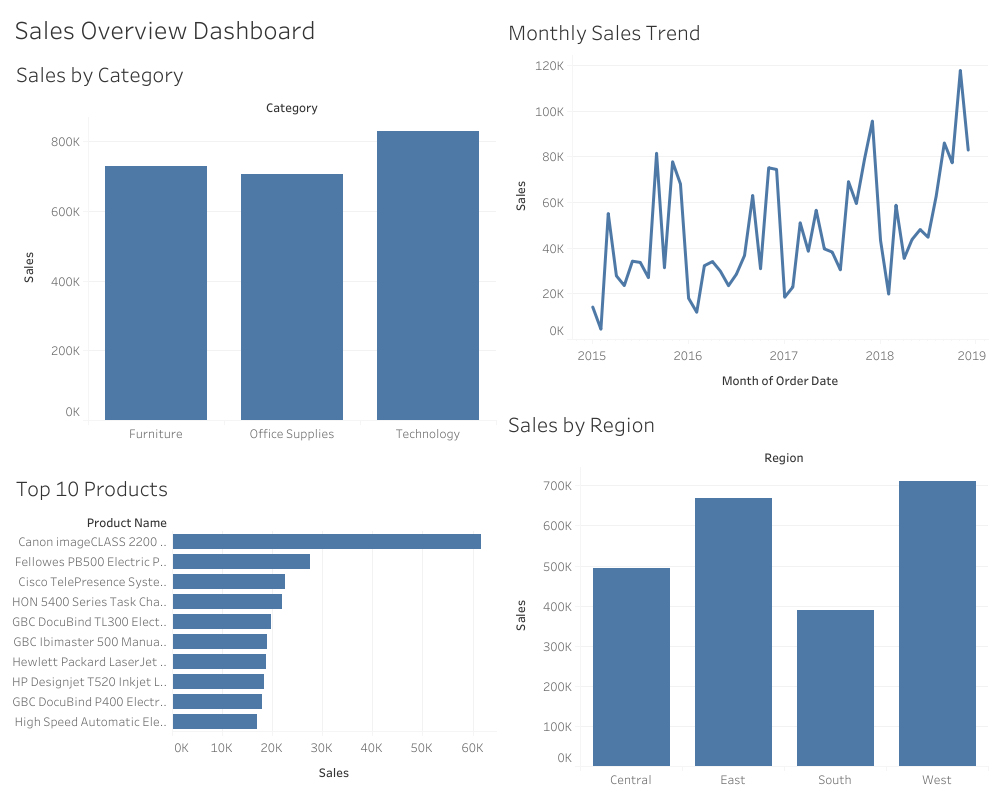

# Retail Customer Analytics

End-to-end analysis of retail sales and customer behavior using Python, SQL, Tableau and machine learning (K-Means customer segmentation).

## Project Overview

This project analyzes four years (2015–2018) of transaction data from a retail superstore to understand how sales perform across product categories, regions and customer segments, and to identify which customers drive the most revenue.

It covers a complete analytics workflow: data cleaning and EDA in Python, business queries in SQL, an interactive Tableau dashboard, and a K-Means model that groups customers into actionable segments.

## Dashboard Preview



*Interactive dashboard built in Tableau, combining sales performance by category, region, time trend, and top-performing products.*

## Business Questions

- Which product categories generate the most revenue, and which sell most often?
- How do regions compare in orders, customers and revenue?
- Which products drive the highest sales?
- How do sales change over time, and is there seasonality?
- Which customer groups are the most valuable, and how should they be targeted?

## Dataset

- **Source:** [Superstore Sales Dataset (Kaggle)](https://www.kaggle.com/datasets/vivek468/superstore-dataset-final)
- **Period:** 2015–2018
- **Scope:** 4,922 orders from 793 customers (9,800 line items)
- **Key fields:** Order ID, Order Date, Customer ID, Segment, Region, Category, Sub-Category, Product Name, Sales

The dataset is included in this repository at `data/superstore.csv`.

## Tools & Technologies

| Tool | Purpose |
|---|---|
| Python (pandas, NumPy, matplotlib, seaborn, scikit-learn) | Data cleaning, EDA, customer segmentation |
| Jupyter / VS Code | Notebook development |
| SQL (MySQL) | Business KPI and aggregation queries |
| DBeaver | Database management and SQL query execution |
| Tableau Cloud | Interactive dashboard |
| Git / GitHub | Version control and portfolio hosting |

*While Excel is commonly used for initial data exploration, this project uses Python for more scalable and reproducible analysis.*

## Workflow

### 1. Data Cleaning & EDA (Python)
`python/01_data_cleaning_eda.ipynb`

- Checked shape, column types and missing values
- Converted date columns from strings to datetime
- Kept missing Postal Code values as NaN since they do not affect the analysis
- Verified 0 duplicate rows
- Profiled Sales: mean $230.77 vs. median $54.49, showing a right-skewed distribution (many small sales, a few very large ones)
- Used a log-scale histogram to make the distribution readable despite outliers (most sales fall between $10 and $500)

### 2. Business Queries (SQL)
`sql/`

Six queries, each cross-checked against the Python results:

| # | Query | Finding |
|---|---|---|
| 1 | `01_kpi_overview.sql` | 4,922 orders, 793 customers, $2,261,536.78 revenue, $230.77 average sale |
| 2 | `02_sales_by_category.sql` | Office Supplies has the most orders (3,676) but lower revenue — cheap products that sell often |
| 3 | `03_sales_by_region.sql` | The South has fewer orders and fewer customers, not just lower spend per customer |
| 4 | `04_monthly_sales_trend.sql` | Growth from 2015 to 2018, with peaks in Nov–Dec and a dip in January |
| 5 | `05_top_10_products.sql` | Canon imageCLASS 2200 Copier ranks #1 with $61,599 from only 5 sales |
| 6 | `06_segment_category_analysis.sql` | Technology leads in all three segments (Consumer, Corporate, Home Office) |

### 3. Dashboard (Tableau Cloud)

Four sheets combined into one dashboard: Sales by Category, Sales by Region, Monthly Sales Trend (by month and year), and Top 10 Products.

### 4. Customer Segmentation (K-Means)
`python/02_customer_segmentation.ipynb`

- Built RFM-style features for each of the 793 customers: Frequency (distinct orders) and Monetary (total sales)
- Scaled features with `StandardScaler`, since Frequency and Monetary are on very different scales and K-Means is distance-based
- Chose K = 4 with the Elbow Method (tested K = 1 to 10)
- Named the clusters by business meaning:

| Segment | Customers | Profile |
|---|---|---|
| VIP | 70 (8.8%) | Avg. spend $9,185 — 28.4% of total revenue |
| Loyal Regular | 175 (22%) | Orders often (avg. 9.4 orders), moderate value |
| Average | 300 (38%, largest group) | 34.1% of total revenue |
| Occasional | 248 (31%) | Lowest frequency and spend |

## Key Insights

- **8.8% of customers (VIPs) generate ~28% of revenue** — the Pareto (80/20) pattern at customer level.
- A few expensive products drive a large share of revenue: the #1 product earned $61,599 from just 5 sales.
- **Office Supplies wins on volume, not revenue** — the most orders, but lower-priced items.
- **Technology dominates every customer segment**, not just one.
- Sales grow year over year and are seasonal: peaks in **November–December**, a dip in January.
- **The South underperforms** on both orders and customer count — a reach problem, not just a spending problem.

## Business Recommendations

- Protect and reward VIP customers (loyalty perks, early access, dedicated service).
- Turn Loyal Regulars into VIPs with bundles and upsells.
- Run re-engagement campaigns for Occasional customers.
- Plan inventory and marketing around the Nov–Dec peak.
- Investigate customer acquisition in the South region.

## Repository Structure

```
Retail-customer-analytics/
│
├── python/
│   ├── 01_data_cleaning_eda.ipynb
│   └── 02_customer_segmentation.ipynb
│
├── sql/
│   ├── 01_kpi_overview.sql
│   ├── 02_sales_by_category.sql
│   ├── 03_sales_by_region.sql
│   ├── 04_monthly_sales_trend.sql
│   ├── 05_top_10_products.sql
│   └── 06_segment_category_analysis.sql
│
├── dashboard/
│   └── dashboard_screenshot.png
│
├── data/
│   └── (superstore.csv — download separately, see Dataset section)
│
├── .gitignore
└── README.md
```

## How to Run

```bash
git clone https://github.com/anxhelavalisi/Retail-customer-analytics.git
cd Retail-customer-analytics
python -m venv venv
source venv/bin/activate        # Windows: venv\Scripts\activate
pip install pandas numpy matplotlib seaborn jupyter scikit-learn openpyxl
```

The dataset is already included in `data/superstore.csv`. Open the notebooks in `python/` to get started.

## Author

**Anxhela Valisi**
Aspiring Data Analyst | Python · SQL · Tableau · Machine Learning

[LinkedIn](https://www.linkedin.com/in/anxhela-valisi) · [GitHub](https://github.com/anxhelavalisi)
